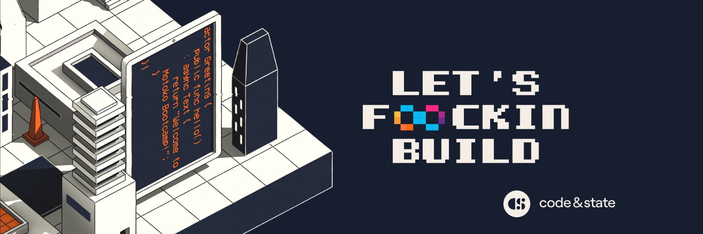

# Motoko Bootcamp - DAO Adventure - Presentation

> The DAO Adventure is a free and open source educational program designed to help you learn about 3 fundamental topics: the Internet Computer, the Motoko language and DAOs. This program is divided into 3 repositories: the Initiation Phase, the Training Phase and the Graduation Phase. This repository contains a general presentation of the program and links to the 3 phases.

## Important resources 📌

- [Motoko Bootcamp Dashboard](https://www.motokobootcamp.com/) (Click on **Login** to access)
- [Motoko Bootcamp Calendar](https://calendar.google.com/calendar/u/0/embed?src=c_1a1c0c95f41c3d5729532726aaa57d96e991c5d3254b0f9e02fdf4d9babf4401@group.calendar.google.com)
- [Motoko Bootcamp Discord](https://discord.gg/qEF2W3dBrd)
- [Initiation repository](https://github.com/motoko-bootcamp/dao-adventure-initiation)
- [Training repository](https://github.com/motoko-bootcamp/dao-adventure-training)
- [Graduation repository](https://github.com/motoko-bootcamp/dao-adventure-graduation)
- [YouTube Playlist](https://www.youtube.com/watch?v=QHzKGGiDrVE)

## Motivation 💭

A DAO, which stands for Decentralized Autonomous Organization, is a new type of organization (or company) that runs leveraging blockchain technology. This enables us to create more transparent, trusted and efficient organisations.

**DAOs** are the biggest innovation in the field of governance since the invention of the [LLC](https://www.investopedia.com/terms/l/llc.asp) or perhaps even democracy itself. Just like the **steam engine** made the **Industrial Revolution** possible by harnessing **physical powe**r, DAOs harness **political power** and make a Web3 revolution possible. This could fundamentally change how we organize resources, people and capital with the end goal of creating a more stable, flourishing, collaborative and fair civilisation.

## What is the DAO Adventure? 🗺️

The **DAO Adventure** is a **free** and **open source** educational program designed to help you learn about 3 fundamental topics:

- The [Internet Computer](internetcomputer.org): the first decentralized cloud, enabling on-chain hosting of websites and fullstack applications.
- The [Motoko language](https://www.youtube.com/watch?v=6YIBRI-1RJs): a new programming language designed for the Internet Computer. It is native to the Internet Computer and optimized for building directly on the blockchain.
- [DAOs](https://www.youtube.com/watch?v=LbkNVP_hlfY): a new type of organization (or company) that runs leveraging blockchain technology. This enables us to create more transparent, trusted and efficient organisations.

The **DAO adventure** is divided in 3 phases:

1.  **Initiation Phase**: you will learn the basics of Web3, the Internet Computer and deploy your first application.
2.  **Training Phase**: you will dive into DAOs and master the Motoko language.
3.  **Graduation Phase**: you will prove your skills by building and deploying your own micro-DAO on the Internet Computer.

The **DAO Adventure** is also a gamified experience. You will be able to automatically record your progression through the [Motoko Bootcamp Dashboard](https://www.motokobootcamp.com/) and earn **rewards**.

## How to get started? 🚀

1.  **Create an account on the Motoko Bootcamp Dashboard**: [https://www.motokobootcamp.com/](https://www.motokobootcamp.com/)
2.  **Join the Motoko Bootcamp Discord**: [https://discord.gg/qEF2W3dBrd](https://discord.gg/qEF2W3dBrd)
3.  Select a starting path among the 3 available options:
    - **Self-paced**: you can follow the adventure at your own pace. You can start at any time and you will be able to access all the resources. You can receive support on our official Discord server.
    - **Motoko Bootcamp**: you can join a 1 week-cohort. During Motoko Bootcamp you will join team, meet with previous graduates, work on collaborative projects, receive additional support from the community and assist to engaging presentations that goes beyond the content of the **DAO Adventure**. You can register on the [Motoko Bootcamp website](https://motokobootcamp.com/).
    - **Workshop** : you can join a 1-hour workshop to learn the basics of Web3, the Internet Computer and deploy your first application. You can register on the [Motoko Bootcamp website](https://motokobootcamp.com/). We host workshops every week.

## How to prepare your environment? 🛠️

The entire DAO Adventure is designed to be completed from your browser. You will not be required to install any software on your computer.  

However, if you wish to install and work locally, then you can follow the [official instructions](https://sdk.dfinity.org/docs/quickstart/local-).

## Phases 📚

### Initiation Phase - 1-2 hours

[ADD IMAGE]

- Objective: learn the basics of Web3, the Internet Computer and deploy your first application.
- Repository: [DAO Adventure - Initiation Phase](https://github.com/motoko-bootcamp/dao-adventure-initiation)
- Reward: The **Student** role and access to our OpenChat community.

## Training Phase - 5 days (4-5 hours per day)

[ADD IMAGE]

- Objective: complete 5 challenges to master the Motoko language.
- Repository: [DAO Adventure - Training Phase](https://github.com/motoko-bootcamp/dao-adventure-training)
- Reward: The **Trained** role.

## Graduation Phase - 2 days (4-5 hours per day)

[ADD IMAGE]

- Estimated duration: 2 days.
- Objective: build and deploy your own micro-DAO on the Internet Computer.
- Repository: [DAO Adventure - Graduation Phase](https://github.com/motoko-bootcamp/dao-adventure-graduation)
- Reward: The **Graduate** role and **Motoko Bootcamp Diploma NFT**.

## After the DAO Adventure 🎓

What is next? Building!

The DAO Adventure is just the beginning of your journey. Many of our students have continued to learn and build on the Internet Computer after they've graduated. We are working on a new program to help you continue your journey. Stay tuned!

## Socials links 🌍

- [Website](https://www.motokobootcamp.com/)
- [Discord](https://discord.gg/Q7WhFTCwnF)
- [Twitter](https://twitter.com/motoko_bootcamp)
- [Youtube](https://www.youtube.com/@motoko_bootcamp)

## Contact 📧

- For any technical questions or support requests, please contact us on our [Discord server](https://discord.gg/Q7WhFTCwnF).
- For business inquiries or partnership : **sebastien.thuillier@codeandstate.com**.

## Credits 🙏

The DAO Adventure is an initiative 100% powered and supported by [Code & State](https://www.codeandstate.com/) - the leading venture studio building on the **Internet Computer**.

## License 📝

The DAO Adventure is licensed under the [Creative Commons Attribution 4.0 International License](https://creativecommons.org/licenses/by/4.0/)

This license allows you to freely use, share, and adapt the content of The DAO Adventure for any purpose, including commercially, as long as appropriate credit is given to the original creator(s). When using our content, you must provide a clear attribution to "Code & State", include a link to the license, and indicate if any changes were made. These terms ensure that the original work is appropriately credited and recognized, fostering a community of sharing and collaboration.

## Final words 🫡

